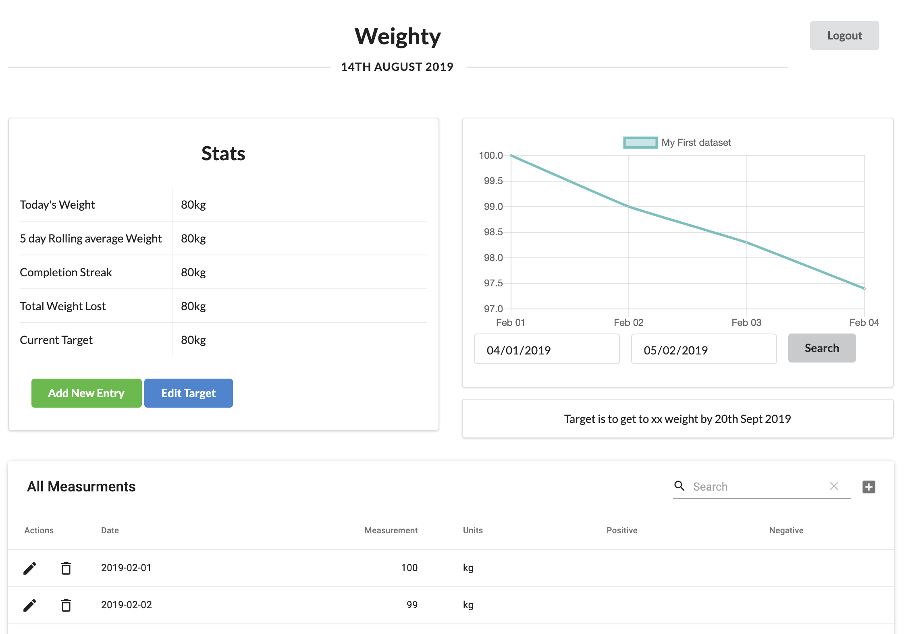
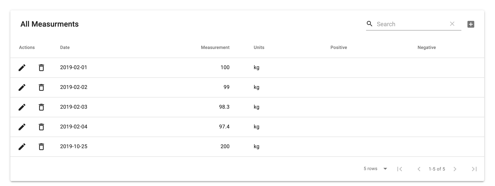

# Weighty 
> Weight tracking app which allows you to login and track you weight over any period of time

## ScreenShots
Main app view

          
Multifunctional Tableview - to view, search and edit all weight entries

          
 
## Functionality
- [X] Add weight and view on graph 
- [X] Edit previous weight either by editing on the table or directly or overwriting measurement on the modal
- [X] Editable graph view which shows all the weight measurements based on the current filter applied
- [ ] Database for persistance of weight measurements (mongodb)
- [ ] Login for users - using socials or email & password combination.
- [ ] Ability to friend other people and check their profile

# Tools
* React 
* React-Chart-js and ChartJs
* Momentjs
* MaterialUI 

## TODOS
- [ ] Complete app functionality
- [ ] Add in Redux for state management
- [ ] Add in Unit tests
